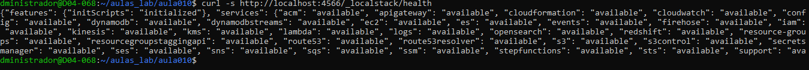
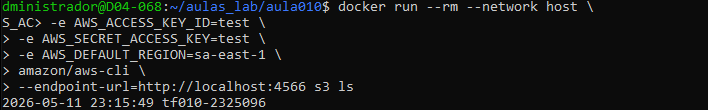
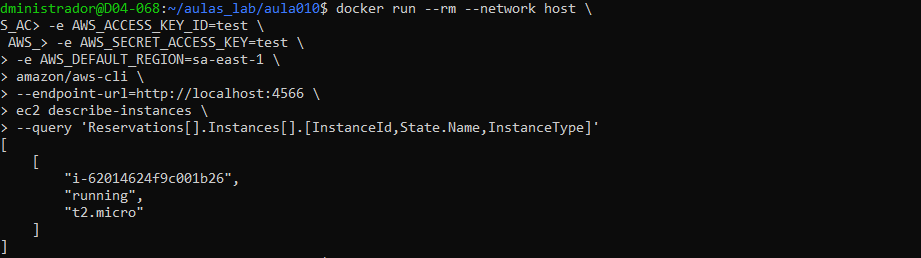

# TF - Aula 10

## RA
2325096

## Nome
SEU NOME

---

# Questão 1

## a)
O AWS EC2 representa o modelo IaaS (Infrastructure as a Service). Neste modelo o usuário gerencia sistema operacional, aplicações e configurações da infraestrutura.

## b)
Exemplo de PaaS: AWS Elastic Beanstalk.

Exemplo de SaaS: Amazon WorkMail.

---

# Questão 2

## a)
Usuário IAM representa uma identidade individual com permissões próprias.

Grupo IAM representa um conjunto de usuários com permissões compartilhadas.

## b)
Roles IAM utilizam credenciais temporárias e evitam o uso de chaves permanentes do usuário root ou administrador, aumentando a segurança.

---

# Questão 3

## a)
Subnet é uma subdivisão lógica dentro de uma VPC.

Subnet Pública possui acesso à internet através de um Internet Gateway.

Subnet Privada não possui acesso direto à internet.

## b)
O Internet Gateway permite conexão com a internet.

O Network ACL é responsável pela inspeção de tráfego em nível de subnet.

---

# Questão 4

## a)
AMI (Amazon Machine Image).

## b)

```bash
ssh -i minha_chave.pem ec2-user@54.123.45.67
```

---

# Questão 5

## Configurar credenciais

```bash
aws configure
```

## Listar instâncias EC2

```bash
aws ec2 describe-instances
```

## Criar bucket S3

```bash
aws s3api create-bucket --bucket meu-bucket-tf10 --region sa-east-1
```

## Descrever VPCs

```bash
aws ec2 describe-vpcs
```

---

# Questão 6

## Evidências

### LocalStack funcionando


### Bucket S3 criado


### Instância EC2 criada


---

# Observações

As atividades práticas foram realizadas utilizando Docker + LocalStack no ambiente WSL/Linux.
