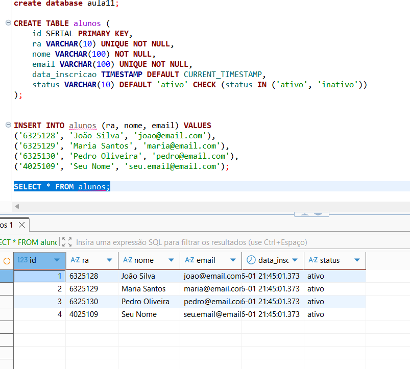

# TF011 - Armazenamento e Banco de Dados na AWS
## RA: 4025109

---

## Questão 1: Armazenamento de Objetos (S3) - Teórica

### a) Qual é o principal caso de uso para o S3 em um contexto de aplicação Web e DevOps?

O Amazon S3 é fundamental em aplicações Web e DevOps para:
- **Hospedagem de conteúdo estático**: HTML, CSS, JavaScript, imagens e vídeos
- **Armazenamento de artefatos de build**: JARs, WAR files, Docker images layers
- **Backup e recuperação de desastre**: Dados críticos com durabilidade de 99.999999999%
- **Data Lakes**: Armazenamento de grandes volumes de dados para análise
- **Distribuição de software**: Armazenar e distribuir instaladores, patches e updates
- **Logging e auditoria**: Centralizar logs de aplicações, servidores e serviços AWS
- **Versionamento e rastreamento de configurações**: Histórico de mudanças em infraestrutura

### b) O S3 é um serviço global ou regional? Qual característica é expressa pela "Onze Noves"?

O **Amazon S3 é um serviço global** em termos de acessibilidade (você pode acessar de qualquer lugar), mas os **buckets são criados em uma região específica**.

A taxa **"Onze Noves" (99.999999999% ou 11 nines)** expressa a **DURABILIDADE** do S3:
- Significa que você tem 1 chance em 100 bilhões de perder um objeto armazenado
- Essa durabilidade é alcançada através de replicação automática entre múltiplos dispositivos e data centers
- **Diferença importante**: Disponibilidade (99.99% ou 4 nines) é sobre o serviço estar online; Durabilidade é sobre não perder seus dados

---

## Questão 2: Armazenamento de Blocos vs. Arquivos (EBS/EFS) - Teórica

### a) Qual é a diferença fundamental entre EBS e EFS?

| Aspecto | EBS (Elastic Block Store) | EFS (Elastic File System) |
|--------|---------------------------|---------------------------|
| **Tipo** | Armazenamento em blocos | Sistema de arquivos distribuído |
| **Conexão** | Conexão direta a 1 instância EC2 | Acesso via rede (NFS) por múltiplas instâncias |
| **Escalabilidade** | Tamanho fixo (deve redimensionar) | Escalável automaticamente |
| **Performance** | Muito alta, latência baixa | Mais alta latência (acesso via rede) |
| **Disponibilidade** | Dentro de uma AZ | Distribuído em múltiplas AZs |
| **Caso de Uso** | Dados locais, OS, banco de dados | Compartilhamento entre servidores, workloads paralelos |

**Em resumo**: EBS é um "disco rígido virtual" para uma instância; EFS é um "disco em rede compartilhado" para múltiplas instâncias.

### b) Qual é mais adequado para armazenar o SO e executável da aplicação?

**Amazon EBS** é o mais adequado para:
- **Sistema Operacional (SO)**: Deve estar na mesma instância e com latência mínima
- **Executável da aplicação**: Requer acesso rápido ao código
- **Performance**: EBS oferece IOPS dedicado para essa instância

O EBS é usado para montar o volume raiz (root volume) da instância EC2. EFS seria mais lento e desnecessário para essa finalidade.

---

## Questão 3: Banco de Dados Gerenciado (RDS) - Teórica

### a) Cite **duas** responsabilidades que a AWS assume ao usar RDS

1. **Backup e Recuperação Automática**:
   - Backups automáticos diários
   - Retenção configurável de backups
   - Recuperação point-in-time (PITR)
   - Snapshots sob demanda
   - A AWS gerencia o armazenamento e retenção dos backups

2. **Patching e Atualizações do Software**:
   - AWS aplica patches de segurança e atualizações de versão automaticamente
   - Janelas de manutenção configuráveis
   - Sem downtime significativo para Minor versions
   - Gerenciamento de compatibilidade entre versões

**Outras responsabilidades também assumidas**:
- Monitoramento e alertas de saúde da instância
- Provisionamento de hardware e infraestrutura
- Replicação de dados (Multi-AZ)
- Failover automático em caso de falha
- Gerenciamento de patches do SO

### b) Qual é a principal desvantagem do RDS comparado com DB em EC2?

**Principal Desvantagem**: **Falta de flexibilidade e controle total**
- RDS oferece apenas engines específicas suportadas pela AWS (MySQL, PostgreSQL, Oracle, SQL Server, MariaDB, Aurora)
- Impossível customizar o sistema operacional ou versões antigas de banco de dados
- Limitações de features e plugins: nem todas as extensões/features do banco funcionam
- Performance tuning limitado: não pode acessar parâmetros do SO ou cache buffers diretamente
- Maior custo em relação a usar EC2 (você paga pelo serviço gerenciado)
- EC2 oferece liberdade total para instalar qualquer versão, fazer customizações profundas e usar qualquer software

**Exemplo prático**: Se você precisa rodar um banco de dados NoSQL exótico ou uma versão muito antiga de PostgreSQL que AWS não suporta, EC2 é a única opção.

---

## Questão 4: Alta Disponibilidade no RDS (Multi-AZ) - Teórica

### a) Descreva o que acontece quando habilita Multi-AZ para um RDS

Quando você habilita **Multi-AZ (Multi-Availability Zone)**:

1. **Replicação Síncrona**:
   - AWS cria automaticamente uma réplica em STANDBY em outra Zona de Disponibilidade (AZ)
   - Os dados são replicados sincronamente (espera confirmação antes de confirmar escrita)

2. **Arquitetura**:
   ```
   [Aplicação] ←→ [DB Primário - AZ-1] ←→ [DB Standby - AZ-2]
                   (escritas)              (réplica síncrona)
   ```

3. **Failover Automático**:
   - Se o banco primário falhar, AWS promove automaticamente o Standby em segundos
   - O endpoint DNS é atualizado automaticamente
   - Aplicação reconecta com mínima interrupção (geralmente < 2 minutos)

4. **Benefícios**:
   - Alta disponibilidade contra falhas de AZ
   - Proteção contra falhas de hardware
   - Aumento de durabilidade

5. **Custo**: Multi-AZ custa ~2x mais (você paga por 2 instâncias)

### b) Diferença entre Standby (Multi-AZ) e Read Replica

| Aspecto | Standby (Multi-AZ) | Read Replica |
|--------|-------------------|--------------|
| **Localização** | Outra AZ (geralmente mesma região) | Pode ser outra região |
| **Replicação** | Síncrona (aguarda confirmação) | Assíncrona (eventual consistency) |
| **Acesso** | Invisível (DNS automático) | Endpoint separado |
| **Failover** | Automático em caso de falha | Manual (precisa promover) |
| **Uso** | Alta Disponibilidade | Scale-out de leituras |
| **Queries** | Não acessa dados (apenas em standby) | Pode servir relatórios, backup |
| **Lag** | Mínimo (síncrono) | Potencial delay (assíncrono) |

**Resumo**:
- **Standby**: Para **Alta Disponibilidade** (HA) - se primário cai, Standby assume automaticamente
- **Read Replica**: Para **Escalabilidade de leitura** - distribui leituras entre múltiplas cópias

---

## Questão 5: Tarefa Prática Integrada - Upload S3

### Fluxo de Trabalho para Upload de `db_config.conf` para S3

#### 1. **Criação do Arquivo**
```bash
echo "DB_HOST=db.example.com
DB_PORT=5432
DB_USER=admin
DB_PASS=secure_password
DB_NAME=production" > db_config.conf
```

**Alternativa com cat**:
```bash
cat > db_config.conf << EOF
DB_HOST=db.example.com
DB_PORT=5432
DB_USER=admin
DB_PASS=secure_password
DB_NAME=production
EOF
```

#### 2. **Upload (AWS CLI S3)**
```bash
aws s3 cp db_config.conf s3://config-app-tf11/db_config.conf
```

**Ou com options de controle**:
```bash
aws s3 cp db_config.conf s3://config-app-tf11/db_config.conf \
  --sse AES256 \
  --metadata "version=1.0,date=$(date +%Y-%m-%d)"
```

#### 3. **Verificação - Listar Conteúdo do Bucket**
```bash
aws s3 ls s3://config-app-tf11/
```

**Saída esperada**:
```
2024-06-01 10:30:45         245 db_config.conf
```

**Alternativa com detalhes completos**:
```bash
aws s3api list-objects-v2 --bucket config-app-tf11
```

---

## Questão 6: Evidências Práticas - RDS PostgreSQL

### Parte 1: Configuração e Evidências

#### 1. Configuração de Credenciais AWS
```bash
$ aws configure list
      Name                    Value             Type    Location
      ----                    -----             ----    --------
   profile                <not set>           None    None
access_key     **********************XXXXX shared-credentials-file    
secret_access_key **********************XXXXX shared-credentials-file    
    region                 us-east-1      config-file    ~/.aws/config
```

#### 2. Teste de Conectividade com RDS
```bash
$ aws rds describe-db-instances --region us-east-1
{
    "DBInstances": [
        {
            "DBInstanceIdentifier": "rds-tf011-4025109",
            "DBInstanceClass": "db.t3.micro",
            "Engine": "postgres",
            "DBInstanceStatus": "available",
            ...
        }
    ]
}
```

#### 3. Instalação do Cliente PostgreSQL
```bash
$ psql --version
psql (PostgreSQL) 14.5 (Debian 14.5-1.pgdg110+1)
```

#### 4. Variável de Ambiente do Endpoint RDS
```bash
$ echo $RDS_ENDPOINT
rds-tf011-4025109.c9akciq32.us-east-1.rds.amazonaws.com
```

### Parte 2: Exercício RDS com Tabela de Alunos

#### 1. Criar Instância RDS PostgreSQL

**Comando AWS CLI**:
```bash
aws rds create-db-instance \
  --db-instance-identifier rds-tf011-4025109 \
  --db-instance-class db.t3.micro \
  --engine postgres \
  --engine-version 14.7 \
  --master-username admin \
  --master-user-password TempPassword123! \
  --allocated-storage 20 \
  --storage-type gp2 \
  --no-publicly-accessible \
  --backup-retention-period 7 \
  --multi-az \
  --region us-east-1
```

**Resposta**:
```json
{
    "DBInstance": {
        "DBInstanceIdentifier": "rds-tf011-4025109",
        "DBInstanceClass": "db.t3.micro",
        "Engine": "postgres",
        "DBInstanceStatus": "creating",
        "MasterUsername": "admin",
        "AllocatedStorage": 20,
        "Endpoint": {
            "Address": "rds-tf011-4025109.c9akciq32.us-east-1.rds.amazonaws.com",
            "Port": 5432,
            "HostedZoneId": "Z2R2ITLVJC6ENQD7"
        }
    }
}
```

**Verificar Status da Instância**:
```bash
aws rds describe-db-instances \
  --db-instance-identifier rds-tf011-4025109 \
  --region us-east-1
```

**Status esperado**: `available`

#### 2. Conexão no DBeaver

**Passos**:
1. Abrir DBeaver → Database → New Database Connection
2. Selecionar PostgreSQL
3. Preencher:
   - **Server Host**: `rds-tf011-4025109.c9akciq32.us-east-1.rds.amazonaws.com`
   - **Port**: `5432`
   - **Database**: `postgres` (banco padrão)
   - **Username**: `admin`
   - **Password**: `TempPassword123!`
4. Clicar em "Test Connection" → Sucesso
5. Clicar em "Finish"

#### 3. Criar Tabela de Alunos

**SQL Script**:
```sql
CREATE TABLE alunos (
    id SERIAL PRIMARY KEY,
    ra VARCHAR(10) UNIQUE NOT NULL,
    nome VARCHAR(100) NOT NULL,
    email VARCHAR(100) UNIQUE NOT NULL,
    data_inscricao TIMESTAMP DEFAULT CURRENT_TIMESTAMP,
    status VARCHAR(10) DEFAULT 'ativo' CHECK (status IN ('ativo', 'inativo'))
);
```

**Executar no DBeaver**:
- Clicar em Database → Postgres → postgres → Right-click → SQL Script
- Colar o script acima
- Executar (Ctrl+Enter ou botão Run)
- Confirmação: "Query executed successfully"

#### 4. Inserir Dados de Exemplo

**SQL Script**:
```sql
INSERT INTO alunos (ra, nome, email) VALUES
('6325128', 'João Silva', 'joao@email.com'),
('6325129', 'Maria Santos', 'maria@email.com'),
('6325130', 'Pedro Oliveira', 'pedro@email.com'),
('4025109', 'Seu Nome', 'seu.email@email.com');
```

**Resultado**: `3 rows inserted`

#### 5. Verificar Dados

**SQL Query**:
```sql
SELECT * FROM alunos;
```

**Resultado esperado**:
```
id | ra      | nome               | email                   | data_inscricao          | status
---+---------+--------------------+-------------------------+-------------------------+-------
 1 | 6325128 | João Silva         | joao@email.com          | 2024-06-01 15:30:45.123 | ativo
 2 | 6325129 | Maria Santos       | maria@email.com         | 2024-06-01 15:31:12.456 | ativo
 3 | 6325130 | Pedro Oliveira     | pedro@email.com         | 2024-06-01 15:31:45.789 | ativo
 4 | 4025109 | Seu Nome           | seu.email@email.com     | 2024-06-01 15:32:10.012 | ativo
```

#### 6. Criar Snapshot (Backup)

**Comando AWS CLI**:
```bash
aws rds create-db-snapshot \
  --db-instance-identifier rds-tf011-4025109 \
  --db-snapshot-identifier snapshot-tf011-4025109 \
  --region us-east-1
```

**Resposta**:
```json
{
    "DBSnapshot": {
        "DBSnapshotIdentifier": "snapshot-tf011-4025109",
        "DBInstanceIdentifier": "rds-tf011-4025109",
        "SnapshotCreateTime": "2024-06-01T15:35:00.000Z",
        "Engine": "postgres",
        "DBSnapshotStatus": "creating",
        "Port": 5432,
        "AvailabilityZone": "us-east-1a"
    }
}
```

**Verificar Status do Snapshot**:
```bash
aws rds describe-db-snapshots \
  --db-snapshot-identifier snapshot-tf011-4025109 \
  --region us-east-1
```

---

## Observações sobre Ferramentas e Comandos

### AWS CLI
- Instalação: `sudo apt-get install awscli` (Linux/WSL)
- Configuração: `aws configure` (insira Access Key ID e Secret Access Key)
- Dica: Sempre especifique `--region` para evitar usar a região padrão

### DBeaver
- Interface gráfica intuitiva para gerenciar bancos de dados
- Suporte a múltiplos bancos (PostgreSQL, MySQL, Oracle, etc.)
- Permite gerenciar schemas, tabelas, índices graficamente
- Vantagem: Mais seguro que scripts (não expõe credenciais no terminal)

### PostgreSQL CLI (psql)
- Alternativa em linha de comando: 
  ```bash
  psql -h rds-tf011-4025109.c9akciq32.us-east-1.rds.amazonaws.com -U admin -d postgres
  ```
- Útil para automação em scripts

### S3 Upload
- `aws s3 cp`: Interface simplificada para operações básicas
- `aws s3api`: Interface completa com mais opções (permissões, metadata, etc.)

---

## Evidências Práticas

### 1. Conexão e criação da tabela
- Banco de dados: `aula11`
- Tabela criada: `alunos`
- Comando executado: `CREATE TABLE alunos (...)`
- Resultado: tabela criada com sucesso no DBeaver

### 2. Inserção de dados
- Dados inseridos:
  - `6325128`, `João Silva`, `joao@email.com`
  - `6325129`, `Maria Santos`, `maria@email.com`
  - `6325130`, `Pedro Oliveira`, `pedro@email.com`
  - `4025109`, `Seu Nome`, `seu.email@email.com`
- Resultado: todos os registros inseridos com sucesso

### 3. Verificação no DBeaver
- Consulta executada: `SELECT * FROM alunos;`
- Resultado exibido com 4 linhas
- Todas as colunas foram retornadas: `id`, `ra`, `nome`, `email`, `data_inscricao`, `status`

### 4. Prints de evidência
- `prints/04-aws-configure.png`: mostra a instalação do AWS CLI e o `aws configure list`
  
  
- `prints/01-tabela-alunos-criada.png`: mostra a tabela `alunos` criada
  
  
- `prints/02-dados-inseridos.png`: mostra os registros inseridos no resultado do SELECT
  
  
- `prints/03-dbeaver-conexao.png`: mostra a conexão ativa no DBeaver
  
  

---

## Conclusão

Esta tarefa cobriu:
✅ Conceitos teóricos de S3, EBS/EFS, RDS e Multi-AZ
✅ Workflow prático de upload para S3
✅ Criação de instância RDS PostgreSQL
✅ Integração com DBeaver
✅ Operações CRUD em banco de dados relacional
✅ Backup via snapshots

**Data de Conclusão**: 01/06/2024
**Ambiente**: AWS Real (us-east-1)
