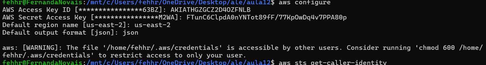
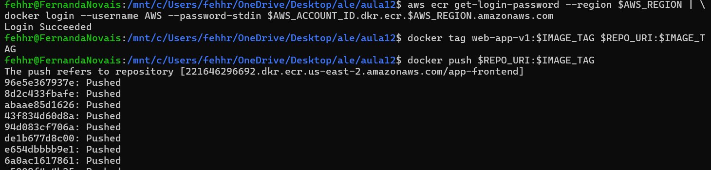
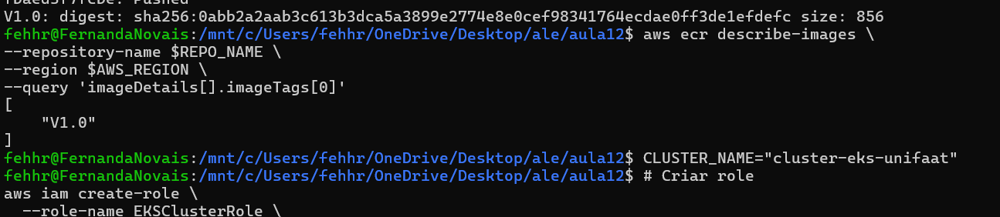
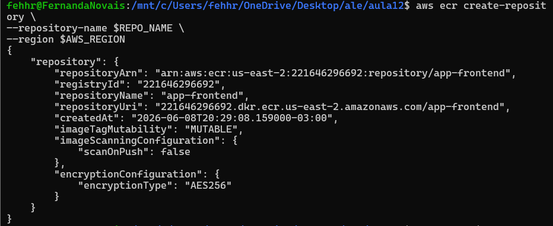
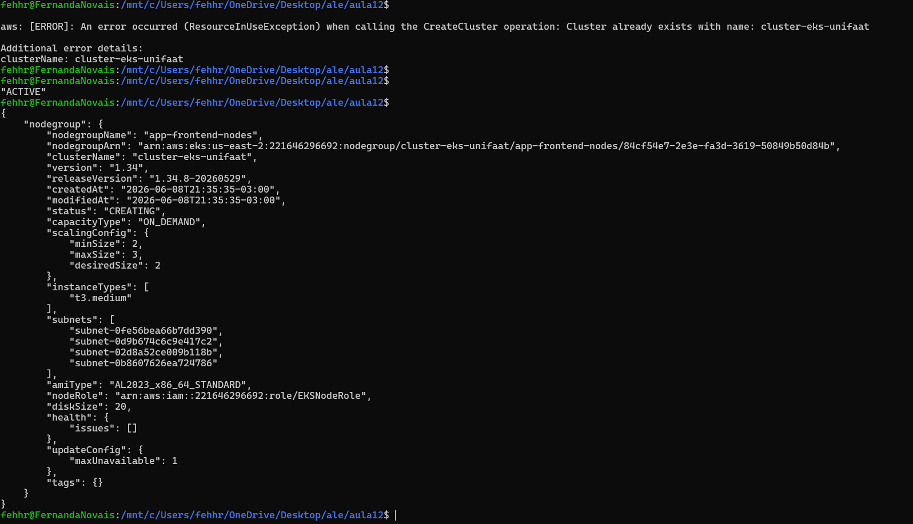
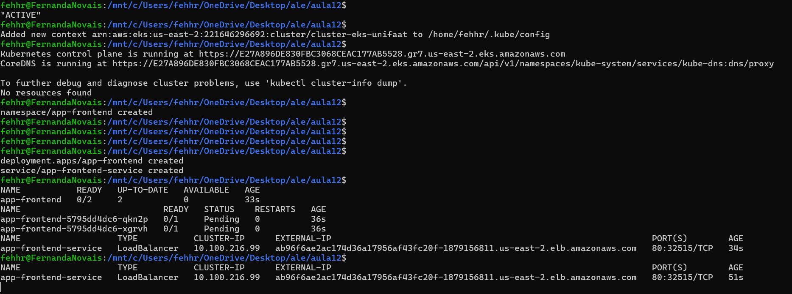

# TF - Tarefa Final - Aula 12

**Disciplina:** Implementação de Servidor e Nuvem (Cloud)
**Aluno:** Fernanda Rosa Novais
**RA:** SEU_RA

## Questão 1: Conceitos de CI/CD

### a) CI (Continuous Integration)

A Integração Contínua tem como objetivo integrar frequentemente as alterações de código realizadas pelos desenvolvedores em um repositório central. Durante essa fase, o código é compilado, testado automaticamente e validado, permitindo a identificação rápida de erros e reduzindo problemas de integração.

### b) CD (Continuous Delivery/Deployment)

A Entrega Contínua ou Implantação Contínua tem como objetivo automatizar o processo de disponibilização do artefato gerado na fase de CI para os ambientes de teste ou produção. O artefato construído é preparado para implantação ou implantado automaticamente, dependendo da estratégia adotada.

---

## Questão 2: Ferramentas de Pipeline

Três ferramentas ou serviços que podem ser utilizados na fase de CI são:

1. Jenkins;
2. GitHub Actions;
3. AWS CodeBuild.

---

## Questão 3: Amazon ECR

### a)

A principal vantagem do Amazon ECR é a segurança e a integração nativa com os serviços da AWS. Diferentemente de um Docker Hub público, o ECR permite armazenar imagens privadas com controle de acesso baseado em IAM, aumentando a proteção das aplicações.

### b)

O Amazon ECR é um serviço regional.

O formato padrão do URI de um repositório ECR é:

```
<ID_CONTA>.dkr.ecr.<REGIAO>.amazonaws.com/<NOME_REPOSITORIO>
```

Exemplo:

```
123456789012.dkr.ecr.us-east-1.amazonaws.com/web-app-repo
```

---

## Questão 4: Processo de Push

### 1. Passo de Autenticação

Utilizar a AWS CLI para obter a senha temporária e realizar o login do Docker no ECR.

### 2. Passo de Tagging

Utilizar o comando `docker tag` para associar a imagem local ao URI completo do repositório ECR.

### 3. Passo de Upload

Utilizar o comando `docker push` para enviar a imagem para o repositório ECR.

---

## Questão 5: Simulação dos Comandos

### a) Criação do repositório

```bash
aws ecr create-repository \
  --repository-name web-app-repo \
  --region us-east-1
```

### b) Autenticação

```bash
aws ecr get-login-password --region us-east-1 | \
docker login --username AWS --password-stdin \
123456789012.dkr.ecr.us-east-1.amazonaws.com
```

### c) Tagging da imagem

```bash
docker tag web-app:v1 \
123456789012.dkr.ecr.us-east-1.amazonaws.com/web-app-repo:v1
```

### d) Push da imagem

```bash
docker push \
123456789012.dkr.ecr.us-east-1.amazonaws.com/web-app-repo:v1
```

---

## Questão 6: Evidências Práticas








### Parte 1 – Preparação e Configuração

Foram coletadas evidências dos seguintes comandos:

* `aws configure list`
* `aws ecr get-login-password --region $AWS_REGION | docker login --username AWS --password-stdin $AWS_ACCOUNT_ID.dkr.ecr.$AWS_REGION.amazonaws.com`
* `docker build -t web-app-v1:$IMAGE_TAG .`

### Parte 2 – Registro e Push da Imagem

Foram coletadas evidências dos seguintes comandos:

* `aws ecr create-repository --repository-name $REPO_NAME --region $AWS_REGION`
* `aws ecr describe-repositories --repository-names $REPO_NAME --region $AWS_REGION`
* `docker tag web-app-v1:$IMAGE_TAG $REPO_URI:$IMAGE_TAG`
* `docker images | grep $REPO_URI`
* `docker push $REPO_URI:$IMAGE_TAG`

### Parte 3 – Verificação Remota

Foi coletada evidência do comando:

```bash
aws ecr describe-images \
  --repository-name $REPO_NAME \
  --region $AWS_REGION \
  --query 'imageDetails[].imageTags[0]'
```

confirmando que a imagem foi armazenada corretamente no ECR.

### Parte 4 – Observações

Durante a execução do laboratório foram encontrados alguns desafios, como:

* Configuração inicial incorreta das credenciais da AWS CLI;
* Erro `InvalidClientTokenId`, resolvido após a criação de uma Access Key válida;
* Necessidade de autenticação correta do Docker no ECR;
* Problemas de atualização do fork devido a conflitos locais e nomes de arquivos incompatíveis com o Windows.

Todos os problemas foram solucionados, permitindo a conclusão do laboratório e o envio da imagem Docker para o Amazon ECR.

---

## Lista dos comandos executados no Lab012

```bash
docker build -t web-app-v1:$IMAGE_TAG .

aws configure

aws sts get-caller-identity

aws ecr create-repository \
  --repository-name $REPO_NAME \
  --region $AWS_REGION

aws ecr get-login-password --region $AWS_REGION | \
docker login --username AWS --password-stdin \
$AWS_ACCOUNT_ID.dkr.ecr.$AWS_REGION.amazonaws.com

docker tag web-app-v1:$IMAGE_TAG \
$REPO_URI:$IMAGE_TAG

docker push $REPO_URI:$IMAGE_TAG

aws ecr describe-images \
  --repository-name $REPO_NAME \
  --region $AWS_REGION
```
