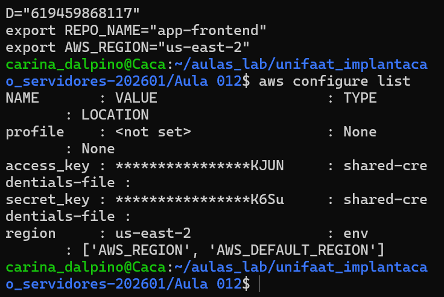
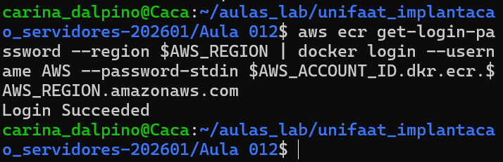
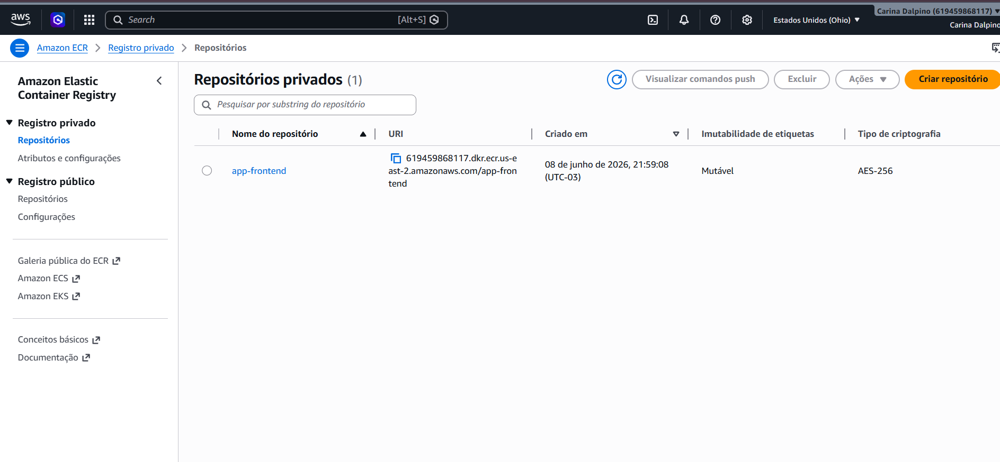

# TF - Tarefa Final - Aula 12
### Aluno: Carina Gonçalves dos Santos Dalpino
### Disciplina: Implementação de Servidor e Nuvem (Cloud)

---

## Questão 1: Conceitos de CI/CD (Teórica)

a) **CI (Continuous Integration):** O objetivo principal é automatizar a integração de alterações de código de múltiplos desenvolvedores em um repositório compartilhado de forma frequente. Nesta fase, o código é buildado automaticamente e submetido a testes automatizados para detectar erros o mais rápido possível, garantindo a estabilidade da aplicação.

b) **CD (Continuous Delivery/Deployment):** O objetivo principal é garantir que o artefato buildado e testado na fase de CI esteja sempre pronto para ser lançado em produção (Delivery) ou seja implantado automaticamente no ambiente final sem intervenção humana (Deployment), acelerando o ciclo de entrega de software.

---

## Questão 2: Ferramentas de Pipeline (Teórica)
Três ferramentas/serviços para automação de CI:
1. **AWS CodeBuild** (Serviço gerenciado da AWS)
2. **GitHub Actions** (Integrado diretamente ao GitHub)
3. **Jenkins** (Ferramenta open-source amplamente utilizada no mercado)

---

## Questão 3: Amazon ECR (Teórica)

a) **Vantagem:** O ECR oferece controle de acesso granular e nativo por meio de políticas do AWS IAM, garantindo segurança perimetral forte. Diferente de um Docker Hub público, as imagens corporativas privadas ficam protegidas contra acessos não autorizados e integradas de forma limpa com outros serviços da AWS (como ECS e EKS).

b) **Região e Formato:** O ECR é um serviço **Regional**. O formato padrão de sua URI é:
`[ID_DA_CONTA].dkr.ecr.[REGIAO].amazonaws.com/[NOME_DO_REPOSITORIO]`

---

## Questão 4: Processo de Push (Prática Teórica)

1. **Passo de Autenticação:** É gerado um token de acesso temporário via AWS CLI que é repassado ao comando `docker login` para dar ao terminal a permissão de escrita no registro.
2. **Passo de Tagging:** A imagem local recebe um novo "carimbo" ou apelido (`docker tag`) contendo o endereço completo (URI) do repositório remoto do ECR.
3. **Passo de Upload:** O comando `docker push` envia as camadas da imagem local de fato para os servidores da AWS.

---

## Questão 5: Tarefa Prática Integrada (Simulação)

a) **Criação do Repositório:**
```bash
aws ecr create-repository --repository-name web-app-repo --region us-east-1

1 - Preparação do Ambiente:

2 - Comando de Autenticação

3 - Criar a variável de Endereço (URI)

4. Aplicar o Carimbo na Imagem (Tagging)


