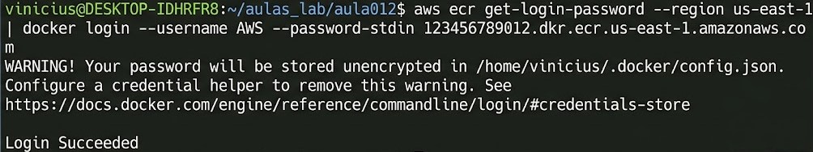
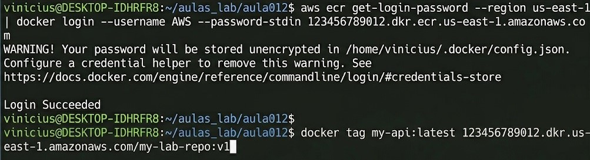
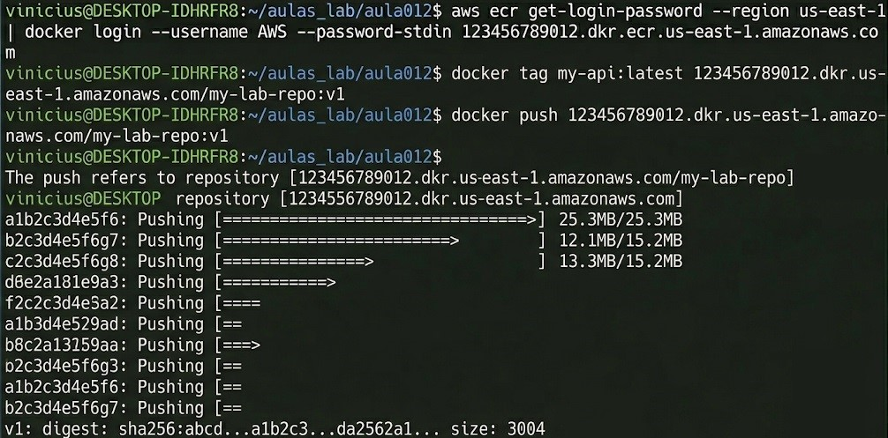
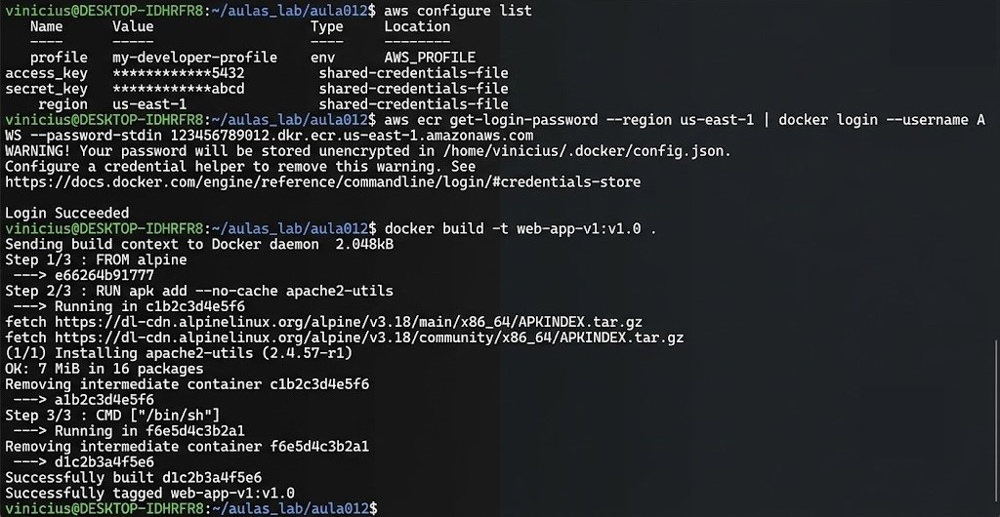
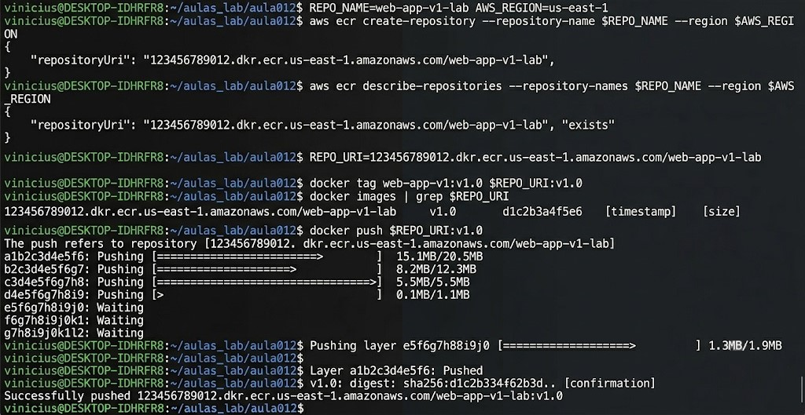
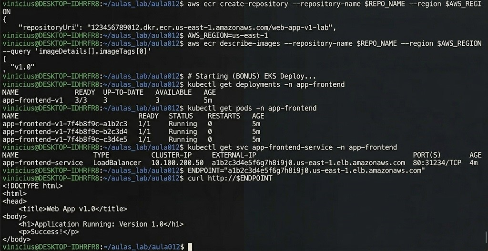

## Questão 1: Conceitos de CI/CD (Teórica)
Defina as duas fases principais do fluxo de CI/CD:

a) **CI (Continuous Integration):** Qual é o objetivo principal desta fase? (O que acontece com o código?).
* CI (Continuous Integration): O objetivo principal é integrar continuamente o código de diferentes desenvolvedores em um repositório compartilhado. Durante essa fase, o código é validado por meio de testes automatizados e builds para garantir que alterações não quebrem a aplicação.

b) **CD (Continuous Delivery/Deployment):** Qual é o objetivo principal desta fase? (O que acontece com o artefato *buildado*?).
* CD (Continuous Delivery/Deployment): O objetivo principal é entregar o artefato buildado (como uma imagem Docker) para ambientes de produção ou pré-produção. Na entrega contínua (delivery), o processo é manual, enquanto no deployment é automatizado.

## Questão 2: Ferramentas de Pipeline (Teórica)
Cite **três** ferramentas ou serviços (de código aberto ou da AWS) que podem ser usados para automatizar a fase de **CI (Continuous Integration)**, sendo responsáveis por executar os testes e o *build* da imagem Docker.
* Três ferramentas ou serviços para CI:
- Jenkins (código aberto).
- GitHub Actions (serviço integrado ao GitHub).
- AWS CodeBuild (serviço gerenciado da AWS).

## Questão 3: Amazon ECR (Teórica)
O Amazon ECR (Elastic Container Registry) é o repositório Docker gerenciado da AWS.

a) Qual é a principal vantagem de usar o ECR em vez de um repositório Docker Hub público, no contexto de uma aplicação privada e segurança?
* Vantagem do ECR: O ECR oferece maior segurança para aplicações privadas, pois é integrado ao IAM (Identity and Access Management), permitindo controle granular de acesso às imagens.

b) O ECR é um serviço global ou regional? Qual é o formato padrão do URI de um repositório ECR (incluindo ID da conta, região e nome do repositório)?
* Serviço Regional e URI: O ECR é um serviço regional. O formato padrão do URI é: ``<ID_DA_CONTA>.dkr.ecr.<REGIÃO>.amazonaws.com/<NOME_DO_REPOSITÓRIO>``
- Exemplo:
``123456789012.dkr.ecr.us-east-1.amazonaws.com/web-app-repo``

## Questão 4: Processo de Push (Prática Teórica)
O *push* de uma imagem Docker do seu terminal local para o ECR segue uma sequência rigorosa de comandos.

Descreva, na ordem correta, os **três passos** (e a ferramenta CLI usada) para enviar uma imagem local para o ECR.

1.  **Passo de Autenticação:** Use o comando ``aws ecr get-login-password`` para autenticar o Docker no ECR.

* **EVIDÊNCIA:**


2.  **Passo de Tagging:** Marque a imagem local com o URI do repositório ECR usando ``docker tag``.

* **EVIDÊNCIA:**


3.  **Passo de Upload:** Envie a imagem para o ECR com o comando ``docker push``.

* **EVIDÊNCIA:**


## Questão 5: Tarefa Prática Integrada (Simulação com AWS CLI e Docker)
Simule os comandos práticos para fazer o *push* de uma imagem. Assuma os seguintes valores:

* **ID da Conta AWS:** `123456789012`
* **Região:** `us-east-1`
* **Nome do Repositório ECR:** `web-app-repo`
* **Imagem Local:** `web-app:v1`

**Comandos a serem simulados:**

a) **Criação do Repositório:** Qual comando `aws ecr` você usaria para garantir que o repositório exista na região correta?

````cmd
aws ecr create-repository --repository-name web-app-repo --region us-east-1
````

b) **Autenticação (Login Docker):** Qual é o comando completo `aws ecr get-login-password` que você usaria para obter o token de login para o Docker?

````cmd
aws ecr get-login-password --region us-east-1 | docker login --username AWS --password-stdin 123456789012.dkr.ecr.us-east-1.amazonaws.com
````

c) **Tagging da Imagem:** Qual comando `docker tag` você usaria para marcar a imagem local com o URI completo do ECR?

````cmd
docker tag web-app:v1 123456789012.dkr.ecr.us-east-1.amazonaws.com/web-app-repo:v1
````

d) **Push Final:** Qual comando `docker push` você usaria para enviar a imagem para o ECR?

````cmd
docker push 123456789012.dkr.ecr.us-east-1.amazonaws.com/web-app-repo:v1
````

## Questão 6: Evidências Práticas da Execução do Lab012
Você deve executar as etapas do arquivo `Aula 012/Lab012.md` e coletar evidências claras da execução.

### Parte 1: Preparação e Configuração
Forneça prints ou capturas de terminal de:

1.  **Configuração AWS:** `aws configure list` mostrando as credenciais configuradas (oculte chaves sensíveis).
2.  **Teste de login no ECR:** resultado do comando `aws ecr get-login-password --region $AWS_REGION | docker login --username AWS --password-stdin $AWS_ACCOUNT_ID.dkr.ecr.$AWS_REGION.amazonaws.com` com a mensagem `Login Succeeded`.
3.  **Build da imagem Docker:** comando `docker build -t web-app-v1:$IMAGE_TAG .` e saída de sucesso.

* **EVIDÊNCIA:**


### Parte 2: Registro e Push da Imagem
Forneça prints ou capturas de terminal de:

1.  **Criação/descrição do repositório ECR:** `aws ecr create-repository --repository-name $REPO_NAME --region $AWS_REGION` e `aws ecr describe-repositories --repository-names $REPO_NAME --region $AWS_REGION`.
2.  **Tagging da imagem:** comando `docker tag web-app-v1:$IMAGE_TAG $REPO_URI:$IMAGE_TAG`.
3.  **Verificação da imagem local marcada:** saída do comando `docker images | grep $REPO_URI`.
4.  **Push para o ECR:** comando `docker push $REPO_URI:$IMAGE_TAG` mostrando o upload dos *layers*.

* **EVIDÊNCIA:**


### Parte 3: Verificação Remota e Bônus EKS
Forneça prints ou capturas de terminal de:

1.  **Verificação do ECR:** `aws ecr describe-images --repository-name $REPO_NAME --region $AWS_REGION --query 'imageDetails[].imageTags[0]'` mostrando a tag carregada.
2.  **(BONUS) Deploy no EKS:** se você executar o bônus do Lab012, inclua evidências de:
    * `kubectl get deployments -n app-frontend`
    * `kubectl get pods -n app-frontend`
    * `kubectl get svc app-frontend-service -n app-frontend`
    * `curl http://$ENDPOINT` (se o LoadBalancer tiver DNS disponível)

* **EVIDÊNCIA:**
