# TF - Aula 12 - CI/CD Básico e Registro de Imagens (ECR)
**RA:** 6325226  
**Aluno:** Weslley Lucas Souza Alves  
**Disciplina:** Implementação de Servidor e Nuvem (Cloud)  
**Aula:** 12 - CI/CD Básico e Registro de Imagens (ECR)

---

## Questão 1 - Conceitos de CI/CD

### a) CI (Continuous Integration)
A Integração Contínua (CI) tem como objetivo integrar frequentemente as alterações de código realizadas pelos desenvolvedores em um repositório central. Durante essa fase, o código é compilado, validado e testado automaticamente para identificar erros o mais cedo possível.

### b) CD (Continuous Delivery/Deployment)
A Entrega Contínua ou Implantação Contínua (CD) tem como objetivo disponibilizar automaticamente os artefatos gerados na fase de CI para ambientes de teste, homologação ou produção. Nessa etapa ocorre a distribuição da aplicação já construída e validada.

---

## Questão 2 - Ferramentas de Pipeline
Três ferramentas que podem ser utilizadas para automatizar a fase de CI são:

1. **Jenkins** - Servidor de automação de código aberto
2. **GitHub Actions** - Serviço nativo do GitHub para CI/CD
3. **AWS CodeBuild** - Serviço da AWS para compilação e teste

Essas ferramentas executam tarefas como compilação, testes automatizados e criação de imagens Docker.

---

## Questão 3 - Amazon ECR

### a) Principal vantagem do ECR
A principal vantagem do Amazon ECR é oferecer armazenamento **privado e seguro** para imagens Docker, integrado ao **IAM da AWS** para controle de acesso e permissões. Isso permite maior segurança em comparação com repositórios públicos como Docker Hub.

### b) Serviço regional e formato do URI
O Amazon ECR é um serviço **regional**.

**Formato padrão do URI:**
```
<ACCOUNT_ID>.dkr.ecr.<REGION>.amazonaws.com/<REPOSITORY_NAME>
```

**Exemplo prático:**
```
123456789012.dkr.ecr.us-east-1.amazonaws.com/web-app-repo
```

---

## Questão 4 - Processo de Push para o ECR

### 1. Passo de Autenticação
Utilizar AWS CLI para obter um token temporário e realizar login no Docker.

```bash
aws ecr get-login-password --region us-east-1 | docker login --username AWS --password-stdin 123456789012.dkr.ecr.us-east-1.amazonaws.com
```

### 2. Passo de Tagging
Associar a imagem local ao URI completo do repositório ECR.

```bash
docker tag web-app:v1 123456789012.dkr.ecr.us-east-1.amazonaws.com/web-app-repo:v1
```

### 3. Passo de Upload (Push)
Enviar a imagem para o repositório ECR.

```bash
docker push 123456789012.dkr.ecr.us-east-1.amazonaws.com/web-app-repo:v1
```

---

## Questão 5 - Simulação AWS CLI e Docker

### a) Criação do Repositório
```bash
aws ecr create-repository \
  --repository-name web-app-repo \
  --region us-east-1
```

### b) Autenticação Docker
```bash
aws ecr get-login-password --region us-east-1 | docker login --username AWS --password-stdin 123456789012.dkr.ecr.us-east-1.amazonaws.com
```

### c) Tagging da Imagem
```bash
docker tag web-app:v1 123456789012.dkr.ecr.us-east-1.amazonaws.com/web-app-repo:v1
```

### d) Push Final
```bash
docker push 123456789012.dkr.ecr.us-east-1.amazonaws.com/web-app-repo:v1
```

---

## Questão 6 - Evidências Práticas

### Parte 1 - Preparação e Configuração

#### Evidência 1: Configuração AWS
**Comando:**
```bash
aws configure list
```
**Descrição:** Comprova que as credenciais AWS estão configuradas corretamente (chaves sensíveis devem ser ocultadas).

---

#### Evidência 2: Autenticação no ECR
**Comando:**
```bash
aws ecr get-login-password --region $AWS_REGION | docker login --username AWS --password-stdin $AWS_ACCOUNT_ID.dkr.ecr.$AWS_REGION.amazonaws.com
```
**Descrição:** Comprova autenticação bem-sucedida no ECR através da mensagem "Login Succeeded".

---

#### Evidência 3: Build da Imagem Docker
**Comando:**
```bash
docker build -t web-app-v1:$IMAGE_TAG .
```
**Descrição:** Comprova a construção da imagem Docker local com sucesso.

---

### Parte 2 - Registro e Push da Imagem

#### Evidência 4: Criação do Repositório ECR
**Comando:**
```bash
aws ecr create-repository --repository-name $REPO_NAME --region $AWS_REGION
```
**Descrição:** Criação do repositório ECR na região especificada.

---

#### Evidência 5: Descrição do Repositório
**Comando:**
```bash
aws ecr describe-repositories --repository-names $REPO_NAME --region $AWS_REGION
```
**Descrição:** Verifica e confirma que o repositório foi criado corretamente.

---

#### Evidência 6: Marcação da Imagem Local
**Comando:**
```bash
docker tag web-app-v1:$IMAGE_TAG $REPO_URI:$IMAGE_TAG
```
**Descrição:** Marcação da imagem local com o URI completo do repositório remoto.

---

#### Evidência 7: Verificação da Imagem Local
**Comando:**
```bash
docker images | grep $REPO_URI
```
**Descrição:** Verificação da imagem marcada localmente antes do push.

---

#### Evidência 8: Upload para ECR
**Comando:**
```bash
docker push $REPO_URI:$IMAGE_TAG
```
**Descrição:** Upload das camadas (layers) da imagem para o ECR, mostrando o progresso de envio.

---

### Parte 3 - Verificação Remota

#### Evidência 9: Verificação do ECR
**Comando:**
```bash
aws ecr describe-images \
  --repository-name $REPO_NAME \
  --region $AWS_REGION \
  --query 'imageDetails[].imageTags[0]'
```
**Descrição:** Confirma que a imagem foi armazenada corretamente no ECR com a tag especificada.

---

### Parte 4 - Bônus EKS (se executado)

#### Evidência 10: Deployments no EKS
**Comando:**
```bash
kubectl get deployments -n app-frontend
```
**Descrição:** Verifica o deployment da aplicação no cluster EKS.

---

#### Evidência 11: Pods em Execução
**Comando:**
```bash
kubectl get pods -n app-frontend
```
**Descrição:** Verifica os pods em execução no namespace app-frontend.

---

#### Evidência 12: Serviço LoadBalancer
**Comando:**
```bash
kubectl get svc app-frontend-service -n app-frontend
```
**Descrição:** Verifica o serviço LoadBalancer criado e obtém o DNS/IP externo.

---

#### Evidência 13: Teste de Acesso
**Comando:**
```bash
curl http://$ENDPOINT
```
**Descrição:** Comprova acesso e funcionamento da aplicação implantada no cluster EKS.

---

## Lista Completa de Comandos Executados

```bash
# Configuração e autenticação
aws configure list

# Criação do repositório
aws ecr create-repository --repository-name $REPO_NAME --region $AWS_REGION

# Descrição do repositório
aws ecr describe-repositories --repository-names $REPO_NAME --region $AWS_REGION

# Login no Docker
aws ecr get-login-password --region $AWS_REGION | docker login --username AWS --password-stdin $AWS_ACCOUNT_ID.dkr.ecr.$AWS_REGION.amazonaws.com

# Build da imagem
docker build -t web-app-v1:$IMAGE_TAG .

# Tagging da imagem
docker tag web-app-v1:$IMAGE_TAG $REPO_URI:$IMAGE_TAG

# Listagem de imagens locais
docker images | grep $REPO_URI

# Push para ECR
docker push $REPO_URI:$IMAGE_TAG

# Verificação no ECR
aws ecr describe-images --repository-name $REPO_NAME --region $AWS_REGION --query 'imageDetails[].imageTags[0]'

# Comandos EKS (opcional/bônus)
kubectl get deployments -n app-frontend
kubectl get pods -n app-frontend
kubectl get svc app-frontend-service -n app-frontend
curl http://$ENDPOINT
```

---

## Prints das Evidências

### Print 01 - Preparação do ambiente
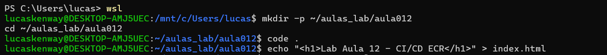

### Print 02 - Configuração AWS e variáveis
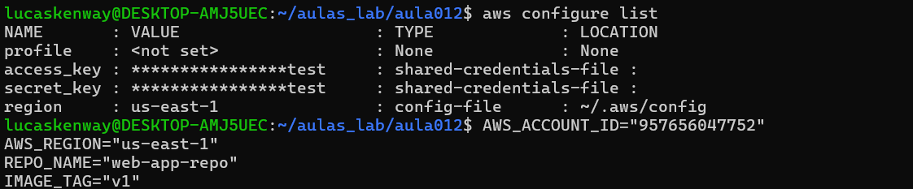

### Print 03 - Build da imagem Docker
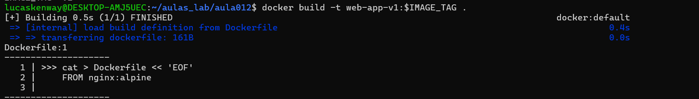

### Print 04 - Listagem de imagens Docker
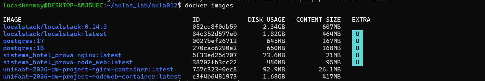

### Print 05 - Dockerfile
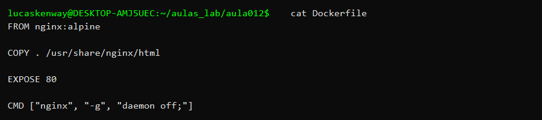

### Print 06 - Build da imagem
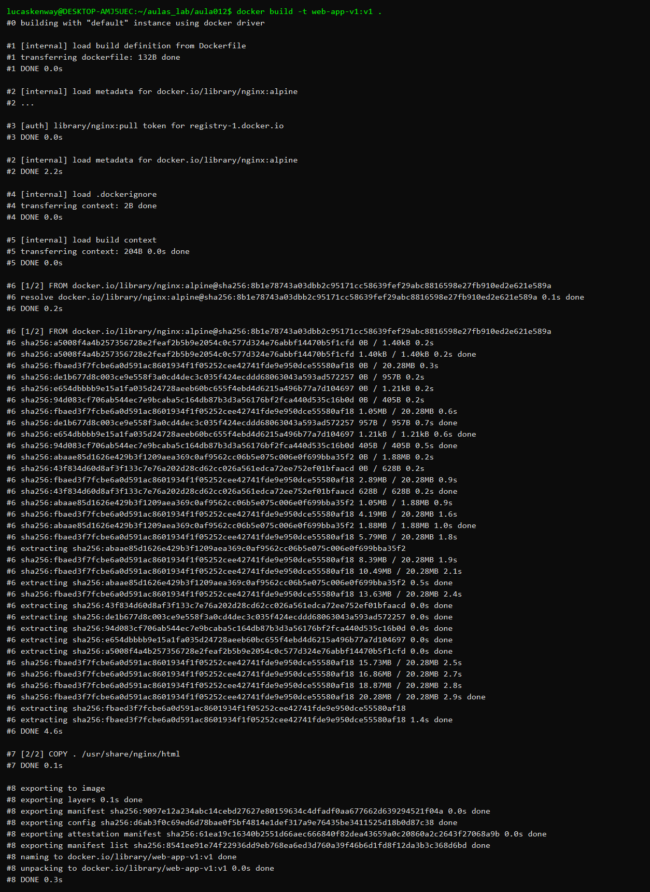

### Print 07 - Imagem local criada
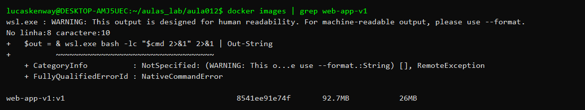

### Print 08 - Verificação de credencial AWS
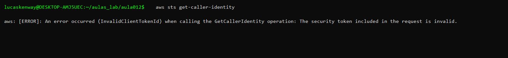

### Print 09 - Criação do ECR
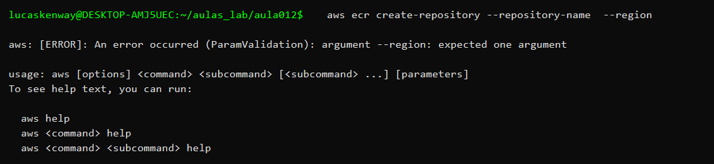

### Print 10 - Tag local para ECR
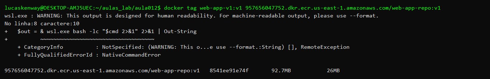

### Print 11 - Dockerfile original
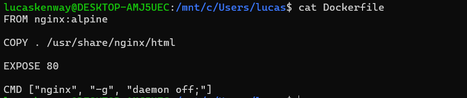

### Print 12 - Delete local Docker
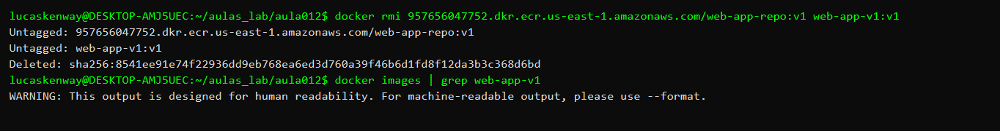

### Print 13 - Delete do ECR
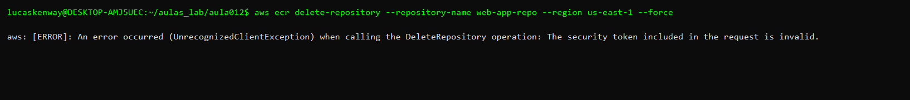

---

## Observações Importantes

Durante a execução do laboratório podem ocorrer os seguintes erros e soluções:

| Erro/Problema | Possível Causa | Solução |
|---|---|---|
| Credenciais AWS não funcionam | Credenciais não configuradas ou expiradas | Executar `aws configure` com as credenciais válidas |
| Docker Desktop não inicia | Serviço Docker não está rodando | Iniciar o Docker Desktop ou serviço Docker |
| Permissão negada no ECR | Permissões insuficientes no IAM | Verificar policy IAM associada ao usuário AWS |
| Região incorreta | Variável `$AWS_REGION` não definida | Exportar a variável: `export AWS_REGION=us-east-1` |
| Token de autenticação expirado | Autenticação antiga (12 horas) | Executar novamente o comando de login |
| Push falha por espaço | Disco cheio ou imagem muito grande | Liberar espaço ou otimizar a imagem |

### Gestão de Custos
⚠️ **IMPORTANTE:** Todos os recursos devem ser removidos após os testes para evitar cobranças desnecessárias na conta AWS, especialmente:
- Cluster EKS (maior gerador de custos)
- ECR repositories
- EC2 instances
- Load Balancers

---

## Estrutura de Arquivos

```
Aula 012/
└── 6325226/
    ├── README.md (este arquivo)
    └── evidencias/ (adicionar prints e capturas se necessário)
```

---

**Data de Conclusão:** 2026-06-08  
**Status:** ✅ Respostas completas e prontas para entrega
