# Questão 1: Conceitos de Kubernetes e EKS

## a) Diferença entre Control Plane e Worker Nodes

O **Control Plane** é o conjunto de componentes responsáveis por gerenciar o cluster Kubernetes. Ele toma decisões globais sobre o ambiente, como agendamento de pods, monitoramento do estado do cluster e resposta a eventos. No Amazon EKS, o Control Plane é gerenciado pela AWS, reduzindo a necessidade de manutenção por parte do usuário.

Os **Worker Nodes** são as máquinas virtuais ou instâncias responsáveis por executar os containers da aplicação. Eles hospedam os pods e fornecem os recursos computacionais necessários para a execução das cargas de trabalho. Os Worker Nodes são gerenciados pelo cliente, embora possam utilizar Node Groups gerenciados pela AWS.

## b) Conceito de self-healing

O self-healing é uma característica do Kubernetes que garante que o estado atual do cluster seja mantido conforme o estado desejado definido nos manifestos.

Quando um pod falha, o Kubernetes detecta essa situação e cria automaticamente um novo pod para substituí-lo, mantendo a quantidade de réplicas especificada no Deployment. Isso aumenta a disponibilidade e a resiliência da aplicação.

# Questão 2: Objetos Kubernetes

## a) Diferença entre Deployment e Service

O **Deployment** é responsável por gerenciar a implantação e o ciclo de vida dos pods, incluindo atualizações, escalabilidade e garantia do número desejado de réplicas.

O **Service** fornece um ponto de acesso estável para os pods, permitindo a comunicação interna ou externa com a aplicação, independentemente da recriação ou alteração dos pods.

## b) Labels e Selectors

**Labels** são pares chave-valor adicionados aos objetos Kubernetes para identificá-los e organizá-los.

**Selectors** são critérios utilizados para selecionar objetos com determinadas labels.

Por exemplo, um pod pode possuir a label:

```yaml
labels:
  app: web
```

E um Service pode utilizar o selector:

```yaml
selector:
  app: web
```

Dessa forma, o Service encaminha o tráfego apenas para os pods que possuem a label correspondente.

## c) Função das Probes

A **livenessProbe** verifica se a aplicação está funcionando corretamente. Caso a verificação falhe repetidamente, o Kubernetes reinicia o container.

Exemplo prático: uma aplicação que entrou em deadlock e deixou de responder.

A **readinessProbe** verifica se a aplicação está pronta para receber tráfego. Enquanto a verificação falhar, o pod não receberá requisições do Service.

Exemplo prático: uma aplicação que precisa concluir a conexão com o banco de dados antes de atender usuários.

# Questão 3: IAM e Permissões

## a) Importância da EKSClusterRole

O cluster EKS precisa de uma IAM Role própria para permitir que o plano de controle interaja com outros serviços da AWS.

Essa role possibilita ações como gerenciamento de recursos de rede, comunicação com grupos de segurança e operação adequada dos componentes necessários ao funcionamento do cluster.

## b) Política AmazonEC2ContainerRegistryReadOnly

Os Worker Nodes precisam dessa política para obter permissão de leitura das imagens armazenadas no Amazon ECR.

Sem essa política, os nós não conseguirão realizar o pull das imagens necessárias para iniciar os containers, fazendo com que os pods permaneçam em estados de erro, como ImagePullBackOff ou ErrImagePull.

# Questão 4: Networking e Exposição

## a) Tipos de Service

**ClusterIP:** disponibiliza o serviço apenas internamente dentro do cluster. É o tipo padrão.

**NodePort:** expõe a aplicação em uma porta fixa de todos os nós do cluster, permitindo acesso externo através do IP do node.

**LoadBalancer:** cria um balanceador de carga externo para disponibilizar a aplicação diretamente para usuários externos.

## b) Service LoadBalancer na AWS

Ao criar um Service do tipo LoadBalancer, a AWS provisiona automaticamente um Elastic Load Balancer (ELB), que distribui o tráfego entre os pods da aplicação.

## c) Exclusão do LoadBalancer antes do cluster

É importante remover o Service do tipo LoadBalancer antes de excluir o cluster para garantir que o balanceador de carga seja removido corretamente.

Caso contrário, recursos podem permanecer ativos na conta AWS, gerando custos desnecessários e dificultando o processo de limpeza do ambiente.

# Questão 5: Tarefa Prática - Comandos EKS

## a) Criar o namespace

```bash
kubectl create namespace minha-app
```

## b) Criar um Deployment com 3 réplicas

```yaml
apiVersion: apps/v1
kind: Deployment
metadata:
  name: web-app
  namespace: minha-app
spec:
  replicas: 3
  selector:
    matchLabels:
      app: web-app
  template:
    metadata:
      labels:
        app: web-app
    spec:
      containers:
      - name: web-app
        image: 111222333444.dkr.ecr.us-east-1.amazonaws.com/web-app:v2.0
        ports:
        - containerPort: 80
```

Aplicação do manifesto:

```bash
kubectl apply -f deployment.yaml
```

## c) Expor a aplicação com Service LoadBalancer

```bash
kubectl expose deployment web-app \
  --namespace=minha-app \
  --type=LoadBalancer \
  --port=80 \
  --target-port=80
```

## d) Escalar o Deployment para 5 réplicas

```bash
kubectl scale deployment web-app \
  --namespace=minha-app \
  --replicas=5
```

## e) Verificar pods e endpoint do LoadBalancer

Verificar os pods:

```bash
kubectl get pods -n minha-app
```

Verificar o Service e obter o endpoint:

```bash
kubectl get svc -n minha-app
```

Também é possível verificar o Deployment:

```bash
kubectl get deployments -n minha-app
```


# Questão 6: Prints

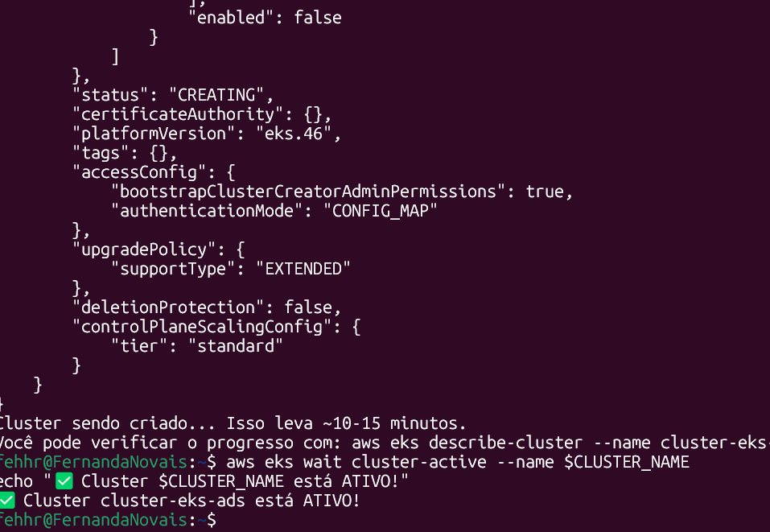
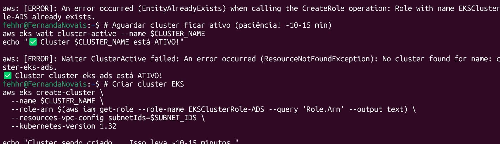
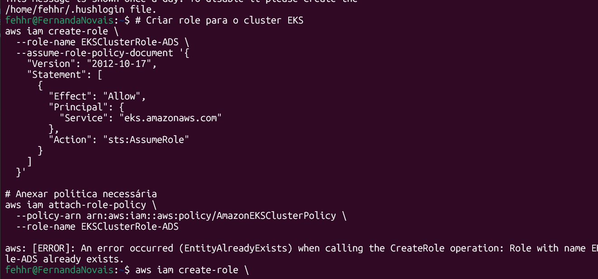

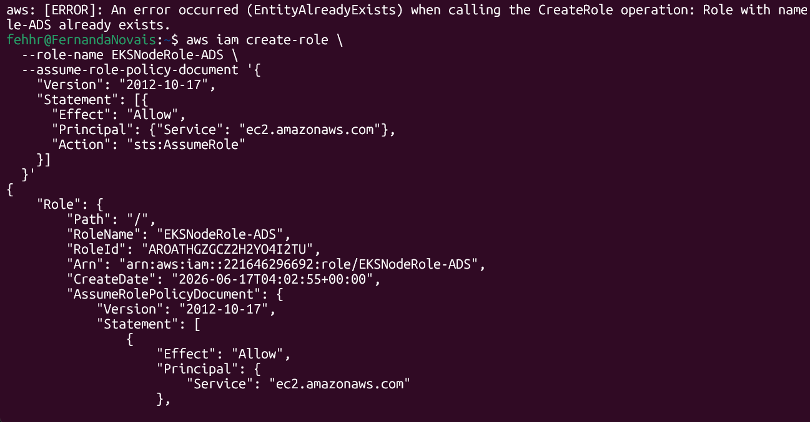
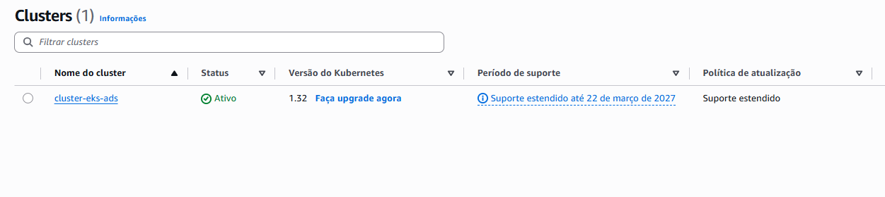
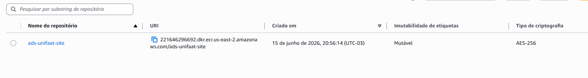
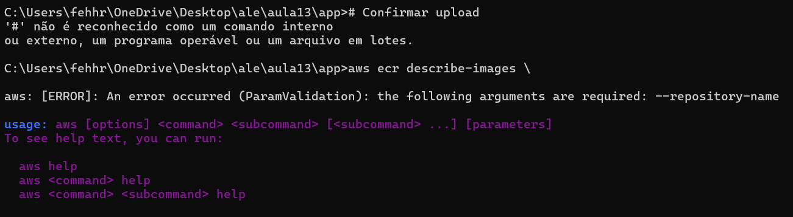
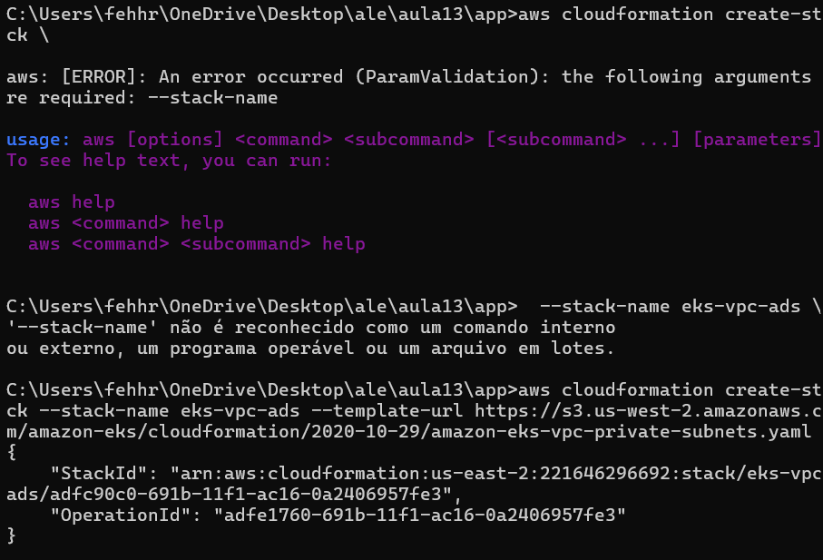
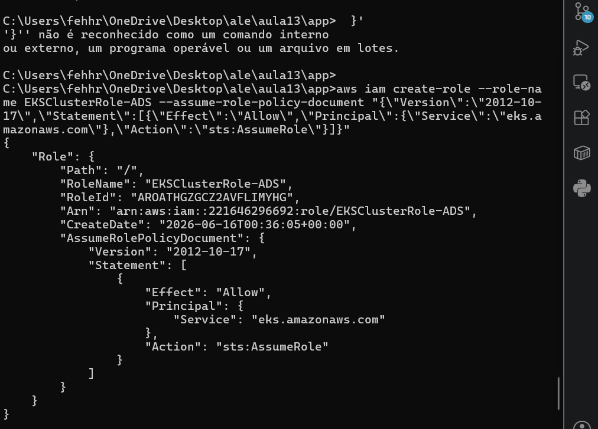
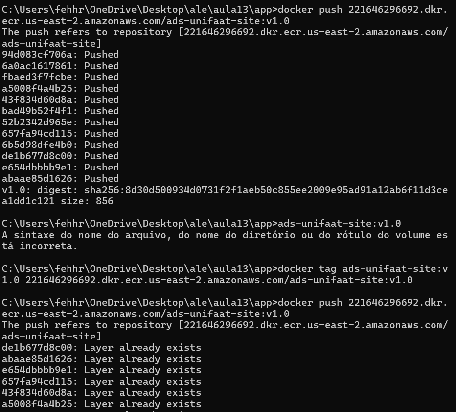
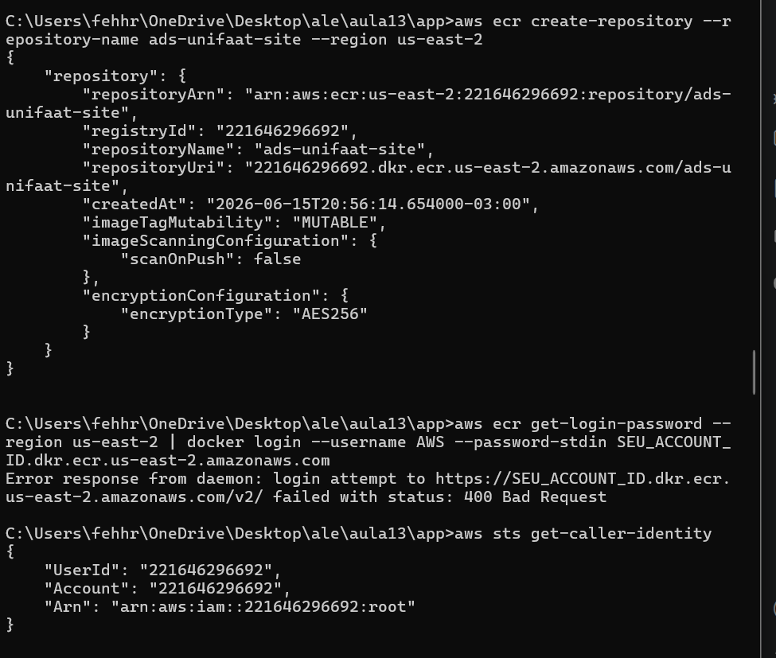
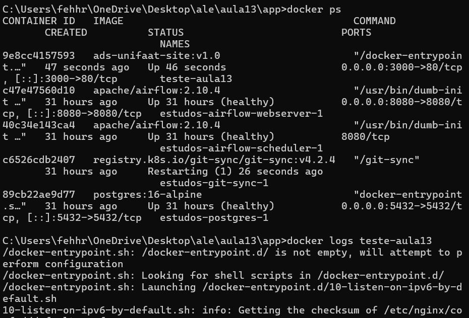