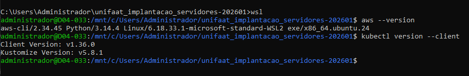

TF - Tarefa Final - Aula 14
Disciplina: Implementação de servidor e nuvem (cloud)

Aula: 14 - Monitoramento e Observabilidade de Containers na AWS

Questão 1: Três Pilares da Observabilidade (Teórica)
A observabilidade moderna se baseia em três pilares fundamentais.

a) Quais são os três pilares da observabilidade e qual é o objetivo específico de cada um?
R: Três pilares da observabilidade:
Logs: registram eventos e erros.
Métricas: medem desempenho e uso de recursos.
Traces: mostram o caminho de uma requisição.

b) No contexto do EKS na AWS, qual serviço/ferramenta é responsável por cada pilar?
R: Logs → Amazon CloudWatch Logs + Fluent Bit
Métricas → Amazon CloudWatch + Container Insights
Traces → AWS X-Ray

c) Explique a diferença entre monitoramento e observabilidade. Por que apenas monitorar não é suficiente?
R: Monitoramento detecta problemas. Observabilidade ajuda a entender a causa dos problemas. Apenas monitorar não mostra o motivo da falha.

Questão 2: CloudWatch Logs e Fluent Bit (Teórica)
A coleta de logs é crucial para debugging e auditoria de aplicações containerizadas.

a) O que é o Fluent Bit e por que ele é deployado como DaemonSet no EKS? O que um DaemonSet garante?
R: Fluent Bit é um coletor de logs. É executado como DaemonSet para garantir um pod em cada node do cluster.

b) Explique a diferença entre Log Group e Log Stream no CloudWatch Logs.
R: Log Group: conjunto de logs.
Log Stream: fluxo individual de logs dentro do grupo.

c) Por que é importante configurar uma política de retenção nos Log Groups? O que acontece se não configurar?
R: A retenção controla custos e armazenamento. Sem configuração, os logs ficam salvos indefinidamente.

Questão 3: Container Insights e Métricas (Teórica)
O Container Insights fornece métricas avançadas para clusters EKS.

a) Qual é a diferença entre as métricas padrão do EKS e as métricas do Container Insights? Que informações extras o Container Insights fornece?
R: O Container Insights fornece métricas mais detalhadas de pods, containers, nodes e namespaces.

b) Explique o que é o namespace de métricas ContainerInsights no CloudWatch e que tipo de dados ele armazena.
R: É o namespace do CloudWatch que armazena métricas do cluster EKS.

c) O que o comando kubectl top pods mostra e por que ele é útil para monitoramento em tempo real?
R: kubectl top pods. Mostra consumo atual de CPU e memória dos pods.

Questão 4: CloudWatch Alarms e Alertas (Teórica)
Os alertas automatizados são essenciais para operações de produção.

a) Explique o que são Evaluation Periods e Threshold em um CloudWatch Alarm. Por que usar mais de 1 período de avaliação?
R: Threshold: valor limite do alerta.
Evaluation Periods: quantidade de períodos analisados.
Mais de um período evita falsos alarmes.

b) Cite os 4 Golden Signals definidos pelo Google SRE e dê um exemplo prático de cada um para a aplicação do Lab014.
R: 4 Golden Signals:
Latency → tempo de resposta.
Traffic → quantidade de requisições.
Errors → erros HTTP 5xx.
Saturation → CPU ou memória alta.

c) O que é um alerta acionável vs um alerta genérico? Dê um exemplo de cada.
R: Acionável: CPU > 90% por 10 min.
Genérico: "Problema detectado no cluster".

Questão 5: Tarefa Prática - Configuração de Monitoramento (Simulação)
Você precisa configurar monitoramento completo para uma aplicação rodando no EKS.

Cenário:
Cluster: producao-cluster
Namespace: minha-api
Log Group: /aws/eks/producao-cluster/api-logs
Região: us-east-1
Descreva os comandos para:
a) Criar o Log Group com retenção de 14 dias.
R: 
aws logs create-log-group --log-group-name /aws/eks/producao-cluster/api-logs

aws logs put-retention-policy \
--log-group-name /aws/eks/producao-cluster/api-logs \
--retention-in-days 14

b) Criar um CloudWatch Alarm que dispare quando a CPU média exceder 75% por 2 períodos consecutivos de 5 minutos.
R:
aws cloudwatch put-metric-alarm \
--alarm-name EKS-HighCPU \
--namespace ContainerInsights \
--metric-name pod_cpu_utilization \
--threshold 75 \
--period 300 \
--evaluation-periods 2

c) Escrever uma query do CloudWatch Logs Insights que conte quantos erros (mensagens contendo "ERROR") ocorreram na última hora, agrupados por intervalos de 10 minutos.
R:
filter @message like /ERROR/
| stats count() by bin(10m)

d) Listar todos os alarmes criados com prefixo "EKS-" em formato de tabela.
R:
aws cloudwatch describe-alarms \
--alarm-name-prefix EKS- \
--output table

e) Criar um Dashboard CloudWatch (descreva a estrutura JSON ou o comando) com 2 widgets: CPU e Memória do cluster.
R:
aws cloudwatch put-dashboard \
--dashboard-name EKS-Monitoramento \
--dashboard-body file://dashboard.json

Questão 6: Evidências Práticas da Execução do Lab014
